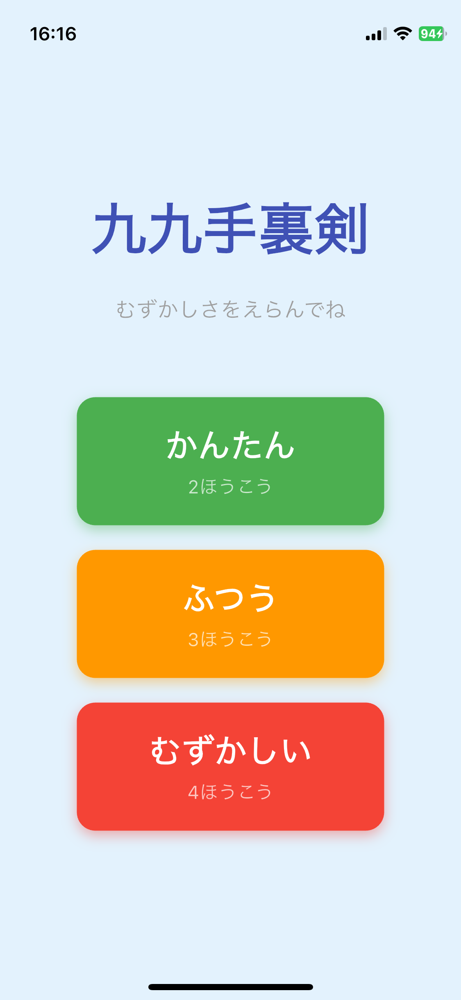
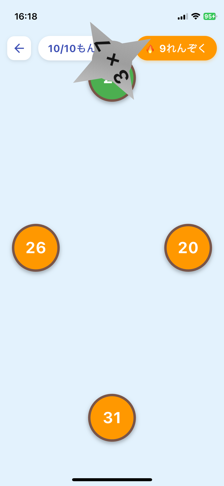

# 九九手裏剣

九九（掛け算）を楽しく学べるフリック式学習アプリです。

## 概要

手裏剣型のカードをフリックして、正解の的に当てよう！
子ども向けの直感的なUIで、ゲーム感覚で九九を覚えられます。

## 機能

- **フリック回答**: 手裏剣カードを正解の方向にフリックして回答
- **3段階の難易度**:
  - かんたん: 2方向（左右）
  - ふつう: 3方向（上左右）
  - むずかしい: 4方向（上下左右）
- **アニメーション**: 手裏剣が回転しながら飛んでいく
- **効果音**: 正解・不正解のフィードバック
- **スコア表示**: 連続正解数、正答率、最大連続正解数

## スクリーンショット

| 難易度選択 | ゲーム画面 | ゲーム画面 |
|:---:|:---:|:---:|
|  |  |  |

## 対応プラットフォーム

- iOS 13.0以上

## ライセンス

MIT License
